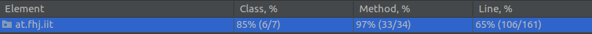

# Drinks Sample

## Authors
- *Simon Noll* : HotDrink.java
- *Manuel Seitinger* : Cocktails.java
- *Helmut Menhart* : FreshJuice.java
------

## Log
- Getting familiar with git(hub); First pulls, commits, pushes, merges ...
- Added class Cocktail
- Implemented methods in class Cocktail
- Added some comments to Cocktail
- Added class FreshJuice.
- Pimped README.md; Tried out some **markdown** features from [Markdown tutorial](https://www.youtube.com/watch?v=6A5EpqqDOdk "Click for watching ;)")
- Added class HotDrink
- Added class Powder
- Implemented methods to HotDrink
- Implemented methods to Powder
- Added comments to HotDrink
- Added comments to Powder
- Added dependencies to pom.xml
- Deleted second README
---------
- **Start of exercise 04**
- Versioned repository --> v1.0
- Created extended (java) .gitignore
- Created branch test_menhart and startig to implement tests...
- Creating FreshJuiceTest and SimpleDrinkTest
- @ test_menhart: Tests implemented successfully - method and line coverage 100%
- Merged test_menhart into main
- Added java doc comments to HotDrink and Powder
- Changed return value of method makeHotDrink to string for testing purpose
- Created branch test_noll
- Created class HotDrinkTest
- Created branch test_seitinger
- Created new test class CocktailTest
- Added comments to HotDrinkTest
- Created and implemented class PowderTest
- Merged test_noll to main
- Created and implemented new test class LiquidTest
- Merged test_seitinger into main
- Added documentation to class Cocktail.java
- Merged changes from test_seitinger into main
- Change directory structure (hopefully) according to maven  
- Edited headlines in README
- Added table in README
- Versioned repository --> v2.0

**Start of exercise 06**
- Pronounced discussion of how to meet requirements of last exercise
- Aggreed on implemeting interface ICashRegister
- Added new attribute to a Drink
- Created new branch cash_register
- Added new method in the abstract class Drink
- Added new class CashRegister and implemented methods
- Added some new output in class Main
- Implemented ICashRegister sell() in class FreshJuice
- Added testCalculateSalesPerVolume() to CashRegisterTest class
- Already approaching pretty good coverage:

_____

- Added testCheckVolume to LiquidTest
- Finalizing project --> merged cash_register into main, solved minor merge-conflict, added tag 3.0 and push!!

### New commands used

|Command| Description|
|:----------:| :----------:|
|git branch 'name'| Creating a new branch|
|git checkout 'name'| Switching between branches|
|git merge| Merging changes into another branch|
-------

## *@Testing*

- Actual junit coverage:

	1. 87% (7/8) class

	2. 93% (31/33) method

	3. 72% (80/110) line

--> The 100% code coverage problem...

### p.e.
- Some getter/setter methods are not used - makes no sense to implement just
to strive for 100%
- Use of testing objects constructed in main?
- Code coverage != quality of tests
- ...

Consider:

For more read this: [click me](https://jeroenmols.com/blog/2017/11/28/coveragproblem/ "your way to interesting article")

---------

# Javadoc crash course

### Why should you use javadoc?

#### Think of yourself in the future!
If your write code and then look at it in a few months, you will not know your way around. You will not know why you did some things in a certain way. By commenting your
code you will save yourself time at understanding what certain parts in a program do.

#### Open-Source programs:
If you write a open-source program and publish it you want people to understand what you have done. If they want to add something to the code or use it, they have to understand it.
There are a lot of open-source projects in the world. Just by commenting your code you can stand out of the crowd by telling the user why your code does certain things in another
or a better way.

#### Become a better programmer!
As a software developer you are a technician. To become a good technician in the software industry you will have to write good documentation. This is hard to learn. So the
best way to learn how to write documentations is by practicing. Start small and become better with the time.

### What to write?

The first question you have to ask yourself is, what is your target audience. That first step is very important because your target audience specifies what should go into
your documentation.

#### Target audience: developers vs. users
Users want to use your code. So, if your program is for end-users your documentation should provide the answer for which problem your program solves. A user doesn't care
in which exact way your software solves a program. For Users you should also provide a tutorial. This helps the user getting to know the program and the tools.
For developers you should make it easy to understand how your code works. It is also useful to tell developers how to contribute something to your code.

### Basics of javadoc

Comments marked with ...

`
/** ... */ #delimiters
`

... are processed by the javadoc tool to generate the API docs

javadoc = The JDK tool that generates API documentation from documentation comments.

## p.e.:
A doc comment is written in HTML and must precede a class, field, constructor or method declaration. It is made up of two parts -- a description followed by block tags.

Order of Tags

Include tags in the following order:

    • @author (classes and interfaces only, required)
    • @version (classes and interfaces only, required. See footnote 1)
    • @param (methods and constructors only)
    • @return (methods only)
    • @exception (@throws is a synonym added in Javadoc 1.2)
    • @see
    • @since
    • @serial (or @serialField or @serialData)
    • @deprecated

**Sources:**

- [oracle / javadoc](https://www.oracle.com/technical-resources/articles/java/javadoc-tool.html)
- [markdown](https://www.markdownguide.org/cheat-sheet)
- [markdown (video)](https://www.youtube.com/watch?v=6A5EpqqDOdk)
- [readme](https://www.makeareadme.com/)
- [beginner guide for javadoc](https://www.writethedocs.org/guide/writing/beginners-guide-to-docs/)
- [git](https://chris.beams.io/posts/git-commit/#seven-rules)
